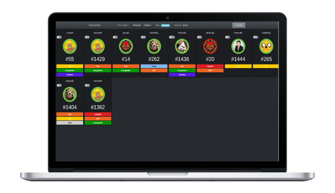

SnowShoe
========

GitHub dashboard to keep tracks on your ongoing PR.



## Requirements

- Node v0.12.2
- Gulp

## Install

First clone the repo:

``` sh
git clone git@github.com:ludovic-gonthier/snowshoe.git
```

If you do not have NodeJS installed yet, we recommend you use [Nvm](https://github.com/creationix/nvm) :

``` sh
cd snowshoe
wget -qO- https://raw.githubusercontent.com/creationix/nvm/v0.25.0/install.sh | bash

## Install the correct node version
nvm install
## Or use the already installed version
nvm use
```

The project is running tasks with [Gulp](http://gulpjs.com/).
To install it:
```
npm install -g gulp
```

Then install the project dependencies:

``` sh
npm install
```

### Github application
While npm is installing dependencies, [create an application on Github](https://github.com/settings/applications/new).
For the field `Authorization callback URL` follow this pattern: `<your.domain.com>/auth/github/callback`, for Snowshoe to be able to log in to github.
After the application creation, note the **Client ID** and the **Client Secret** and set the environment variables in .env file:

e.g.:
```
SERVER_SECRET="xxxxx"
GITHUB_CLIENT_ID="xxxx"
GITHUB_CLIENT_SECRET="xxxxx"
HOSTNAME="127.0.0.1:3000"
GITHUB_POLL_TIMEOUT=60
APP_PROTOCOL="http"
```

Snowshoe uses Browserify to regroup all javascript used in a page in one file.
In addition to that, we transform the JSX files into plain javascript.
To generate the file run:
```
gulp reactify
```

An finally run the server:
```
gulp server
```

### Full installation instructions
```
git clone git@github.com:ludovic-gonthier/snowshoe.git
cd snowshoe

wget -qO- https://raw.githubusercontent.com/creationix/nvm/v0.25.0/install.sh | bash
nvm install

npm install -g gulp
npm install

# create a .env file with
# SERVER_SECRET="xxxxx"
# GITHUB_CLIENT_ID="xxxx"
# GITHUB_CLIENT_SECRET="xxxxx"
# HOSTNAME="127.0.0.1:3000"
# GITHUB_POLL_TIMEOUT=60
# APP_PROTOCOL="http"

gulp reactify
gulp server
```

## Heroku deployment

[](https://heroku.com/deploy)

### Environment variables definition
SERVER_SECRET: secret used for sessions, set it to a long random string
GITHUB_CLIENT_ID: github client id you got from creating the app on github (see [above](#github-application))
GITHUB_CLIENT_SECRET: github secret from last step
HOSTNAME: heroku application name (e.g.: morning-ligh-8678)
GITHUB_POLL_TIMEOUT: control timeout when calling out github api (default: 60 seconds)
APP_PROTOCOL: "https" or "http", on heroku you can safely use https
